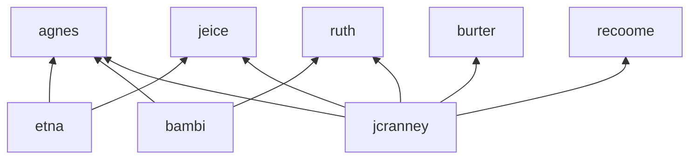

# Notes

- Be sure to read the [den documentation](https://vic.github.io/den)

- Update den input.

```console
nix flake update den
```

- Build and deploy configuration, e.g., on `burter`:

```bash
sudo nixos-rebuild switch --flake .#burter
```

## Layout

### Users

|user|purpose|
|--|--|
| `bambi` | shared admin account, anyone **trusted** can access |
| `etna` | shared guest account, anyone can access |
| `jcranney` | personal admin account, only Jesse can access

### Hosts

|host|purpose|
|--|--|
| `agnes` | General purpose home server, used for home automation, 3d printer interface, home assistant, etc. |
| `ruth` | Network configuration server, used for DNS and Proxy Server admin. |
| `jeice` | Server used to host Jesse's personal web stuff. Currently an AWS, but preferably migrated to locally hosted once we have public access figured out. |
| `burter` | Jesse's main laptop (work, tinkering) |
| `recoome` | Jesse's main desktop (work, tinkering, gaming) |

### Structure

